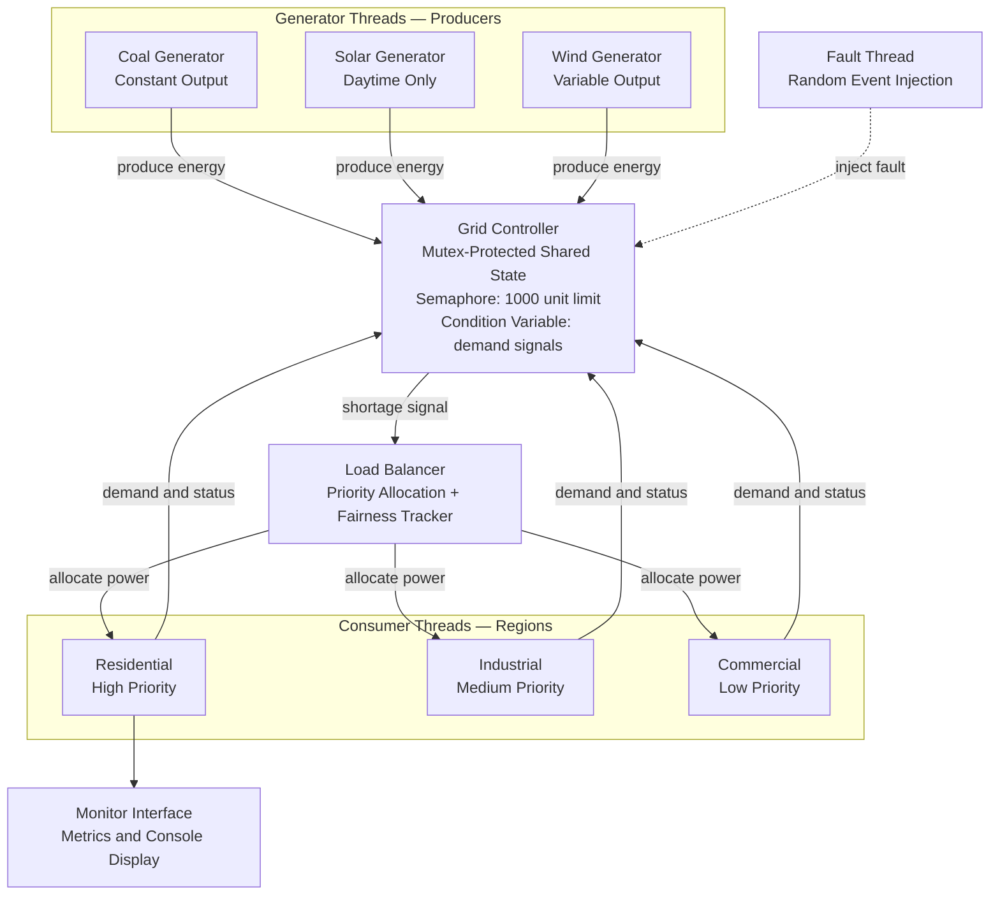

# Smart Energy Grid Load Balancer – A Concurrency Simulation

A multithreaded energy grid simulation built in C using POSIX threads, mutexes, semaphores, and condition variables. Developed as an Operating Systems Theory project at FAST NUCES.

## What it does

Simulates a real-world energy grid where generator threads produce electricity and consumer threads demand it. The system handles shortages using priority-based load balancing, simulates random generator faults and recovery, and tracks fairness across regions.

## How to compile and run

Make sure you are on Linux or WSL with gcc installed. Then run:

make
./grid_sim

To clean the build:

make clean

## File structure

| File | Description |
|------|-------------|
| grid.h | Shared header — GridState struct, constants, and all function declarations |
| main.c | Entry point — initializes grid, spawns all threads, handles cleanup |
| generators.c | Coal, solar, and wind generator threads (producer side) |
| consumers.c | Residential, industrial, and commercial consumer threads (Ayesha) |
| load_balancer.c | Priority-based load balancing with fairness tracking (Manahil) |
| fault.c | Random fault injection and generator recovery thread (Manahil) |
| metrics.c | Periodic reporting of allocation rate and fairness index (Manahil) |
| Makefile | Compiles all files into the grid_sim executable |

## Team

| Name | Role |
|------|------|
| Wardah Ahmed (24K-1045) | Grid foundation, generator threads, main, Makefile |
| Ayesha Tariq (24K-0785) | Consumer threads |
| Manahil Malik (24K-0948) | Load balancer, fault thread, metrics |

## Course

Operating System Theory — FAST NUCES
Instructor: Sir Minhal

## System Architecture



### How it works

1. **Generator threads** run independently and continuously produce energy into the shared grid. Coal runs at a constant rate, solar only during daytime cycles, and wind at random intervals and amounts.
2. **The Grid Controller** sits at the center. It holds all shared state protected by a mutex so only one thread can access it at a time. A semaphore enforces the 1000 unit hard ceiling and a condition variable wakes up waiting consumers when new energy arrives.
3. **The Fault Thread** runs separately and randomly takes generators offline, forcing the system to adapt with reduced supply. Generators recover automatically after a randomized downtime.
4. **When supply runs short** the Grid Controller signals the Load Balancer which distributes available power in priority order. Residential first, then Industrial, then Commercial. A fairness tracker prevents low priority regions from being starved indefinitely.
5. **Consumer threads** report their demand back to the Grid Controller and wait on the condition variable when there isn't enough supply, waking up only when a generator broadcasts that new energy is available.
6. **The Monitor Interface** reads from the shared grid state every 20 seconds and prints an allocation rate and fairness index so you can see how well the system is performing.
```
